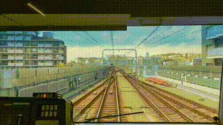

# esp32-video-stream

MJPEG-over-TCP video stream receiver for ESP32. A Python server streams pre-encoded MJPEG frames over TCP. The ESP32 firmware decodes each frame and pushes it to the display.



## Supported Boards

| Board | Display | Decoder | FPS |
|-------|---------|---------|-----|
| Waveshare ESP32-S3 Touch LCD 2.0" | ST7789 320x240 SPI | tjpgd (software, ROM) | ~12 |
| ESP32-P4-Function-EV-Board | EK79007 1024x600 MIPI-DSI | Hardware JPEG decoder | 30 |

## Protocol

Each frame is sent as a 4-byte little-endian length prefix followed by JPEG data. The ESP32 connects to the server as a TCP client.

## Setup

### Server (PC / Pi)

Requires `ffmpeg` installed. Place video files in a `videos/` directory.

```
python stream_video.py videos [--port 5000] [--width 320] [--height 240] [--fps 30] [--compression 10]
```

The `--compression` flag maps to ffmpeg's `-q:v` (2-31, lower means better quality). Videos are pre-encoded to MJPEG AVI on first run and cached in `videos/.cache/`. All videos in the directory are played in a loop as a playlist.

The server supports multiple simultaneous clients — connect several ESP32 boards and they all receive the same stream.

For the P4 board:
```
python stream_video.py videos --width 1024 --height 600
```

For the S3 board:
```
python stream_video.py videos --width 320 --height 240
```

### Firmware

Requires ESP-IDF v5.5+. WiFi credentials are loaded from `~/.esp_creds` via `SDKCONFIG_DEFAULTS` so they are never committed. Create the file with your network details:

```
# ~/.esp_creds
CONFIG_WIFI_SSID="YourNetworkName"
CONFIG_WIFI_PASS="YourPassword"
```

#### Building for ESP32-S3

```
idf.py set-target esp32s3
idf.py build flash monitor
```

#### Building for ESP32-P4

```
idf.py set-target esp32p4
idf.py build flash monitor
```

The target selection is persistent — once set, subsequent `idf.py build` commands use the same target until you change it. Switching targets requires a clean build (handled automatically by `set-target`).

The default server address is `192.168.68.65:5000`. Change it in `idf.py menuconfig` under **Video Stream** or edit `sdkconfig.defaults`.

## How it works

1. `stream_video.py` pre-encodes videos to MJPEG AVI at the target resolution, then reads pre-baked JPEG frames and sends them length-prefixed over TCP at the target frame rate.
2. The firmware connects over WiFi, receives JPEG frames, and decodes them into the display framebuffer.
3. **ESP32-S3:** Software tjpgd decode to RGB565, flushed to ST7789 over SPI at 40 MHz.
4. **ESP32-P4:** Hardware JPEG decode directly into the MIPI-DSI DPI framebuffer (zero-copy, double-buffered). WiFi is provided by an ESP32-C6 co-processor over SDIO via esp_hosted.
